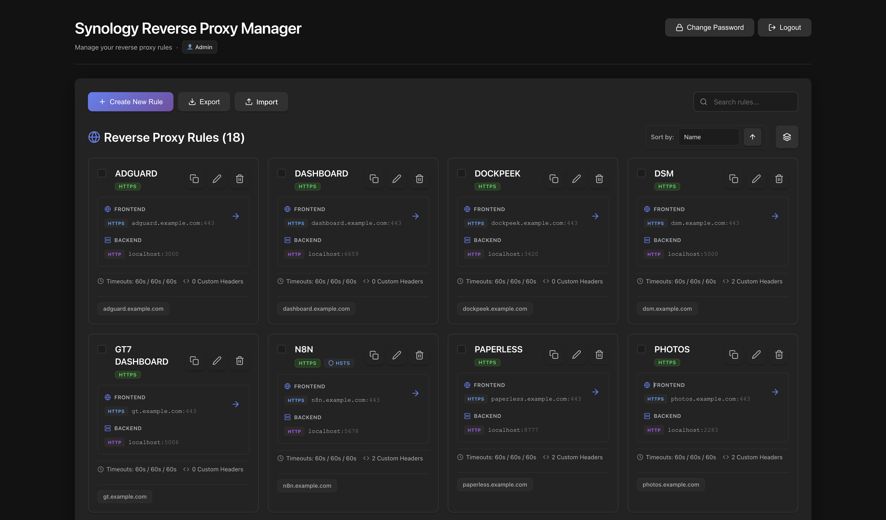
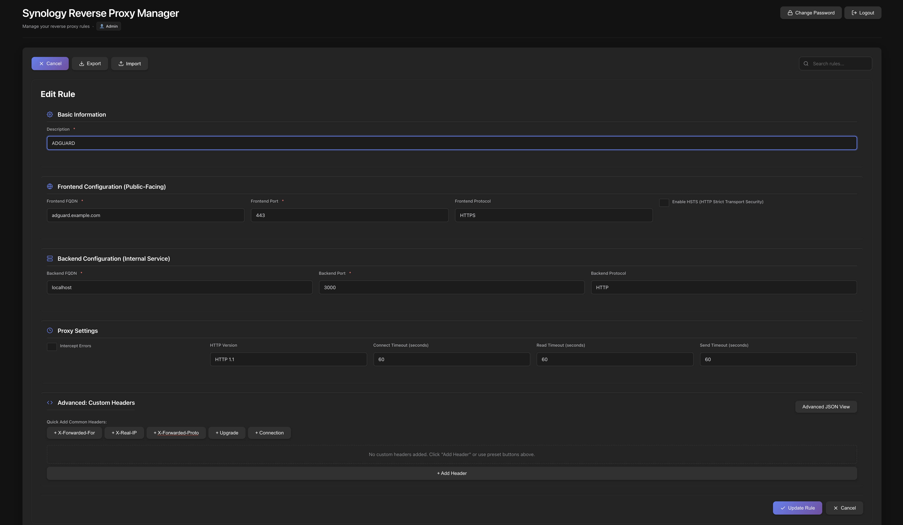

# Synology Reverse Proxy Manager

[](https://github.com/devwareh/SynoReverseProxy/actions/workflows/ci.yml)
[](https://github.com/devwareh/SynoReverseProxy/actions/workflows/docker-publish.yml)
[](https://opensource.org/licenses/MIT)

A web application for managing reverse proxy rules on Synology NAS. Designed for Docker deployment with Portainer and Synology Container Manager.

## Features

- Manage reverse proxy rules through a web interface
- Secure authentication with device tokens (OTP only needed once)
- First-run setup wizard (no default passwords)
- Full CRUD operations on proxy rules
- Import/Export rules as JSON
- Search and filter rules
- Responsive design for mobile and desktop




## Quick Start

### Prerequisites

- Synology NAS with DSM 6.0 or higher
- Docker installed (via Portainer or Synology Container Manager)
- Network access to your NAS

### Deployment

#### Option 1: Portainer (Recommended for Beginners)

This guide walks you through the complete setup process step-by-step.

**Step 1: Create Folders on Your NAS**

1. Open **File Station** on your Synology NAS
2. Navigate to `docker` folder in your main volume (usually `/volume1/docker/`)
   - If it doesn't exist, create it: Right-click → **Create Folder** → Name it `docker`
3. Inside `docker`, create a new folder: `SynoReverseProxy`
4. Inside `SynoReverseProxy`, create three folders:
   - `config`
   - `data`
   - `logs`

Your folder structure should look like:
```
/volume1/docker/SynoReverseProxy/
├── config/
├── data/
└── logs/
```

**Note:** If your main volume is not `volume1`, adjust the path accordingly (e.g., `/volume2/docker/`).

**Step 2: Find Your User ID (PUID/PGID)**

1. Open **Control Panel** → **Terminal & SNMP**
2. Enable **SSH service**
3. Connect via SSH (use Terminal on Mac/Linux, or PuTTY on Windows):
   ```bash
   ssh your_username@your-nas-ip
   ```
4. Run this command:
   ```bash
   id
   ```
5. Note down your `uid` and `gid` numbers (example: `uid=1026 gid=100`)

**Step 3: Install Portainer (if not already installed)**

1. Open **Container Manager** on your Synology
2. Go to **Registry** → Search for `portainer`
3. Download `portainer/portainer-ce`
4. Go to **Container** → **Create**
5. Use these settings:
   - Container Name: `portainer`
   - Port: `9000:9000`
   - Volume: `/var/run/docker.sock:/var/run/docker.sock`
6. Click **Apply** and start the container
7. Access Portainer at `http://your-nas-ip:9000`

**Step 4: Deploy the Application in Portainer**

1. Open Portainer at `http://your-nas-ip:9000`
2. Click **Stacks** → **Add stack**
3. Name it: `syno-reverse-proxy`
4. Paste this docker-compose configuration:

```yaml
version: '3.8'

services:
  backend:
    image: ghcr.io/devwareh/syno-reverse-proxy-backend:latest
    container_name: syno-reverse-proxy-backend
    ports:
      - "18888:18888"
    volumes:
      - /volume1/docker/SynoReverseProxy/data:/app/data
      - /volume1/docker/SynoReverseProxy/logs:/app/logs
      - /volume1/docker/SynoReverseProxy/config:/app/config
    environment:
      # Required: Your Synology NAS details
      - SYNOLOGY_NAS_URL=http://192.168.1.100:5000
      - SYNOLOGY_USERNAME=your_dsm_username
      - SYNOLOGY_PASSWORD=your_dsm_password
      
      # Recommended: Set your user/group ID (from Step 2)
      - PUID=1026
      - PGID=100
      
      # Backend port
      - BACKEND_PORT=18888
    restart: unless-stopped
    networks:
      - syno-network

  frontend:
    image: ghcr.io/devwareh/syno-reverse-proxy-frontend:latest
    container_name: syno-reverse-proxy-frontend
    ports:
      - "8889:8889"
    environment:
      - NGINX_PORT=8889
      - BACKEND_PORT=18888
    depends_on:
      - backend
    restart: unless-stopped
    networks:
      - syno-network

networks:
  syno-network:
    driver: bridge
```

5. **Important:** Update these values in the configuration:
   - `SYNOLOGY_NAS_URL`: Your NAS IP and port (usually `:5000` or `:5001` for HTTPS)
   - `SYNOLOGY_USERNAME`: Your DSM admin username
   - `SYNOLOGY_PASSWORD`: Your DSM password
   - `PUID`: Your user ID from Step 2
   - `PGID`: Your group ID from Step 2
   - **Volume paths**: If your docker folder is not at `/volume1/docker/`, update all three volume paths

6. Click **Deploy the stack**

**Step 5: Access the Web Interface**

1. Wait 30 seconds for containers to start
2. Open your browser and go to: `http://your-nas-ip:8889`
3. You'll see a **Setup Wizard** on first visit
4. Create your admin username and password
5. Click **Complete Setup**
6. Login with your new credentials

**Step 6: Verify Everything Works**

1. After logging in, you should see the dashboard
2. Try creating a reverse proxy rule to test
3. Check File Station - you should see files in `/docker/SynoReverseProxy/config/`
4. If files are owned by your user (not root), PUID/PGID is working correctly! ✅

**Troubleshooting:**

- **Can't access the UI?** 
  - Check if containers are running in Portainer
  - Verify port 8889 is not blocked by firewall
  
- **Setup wizard keeps appearing?**
  - Check if PUID/PGID is set correctly
  - Verify folder permissions in File Station
  
- **Files owned by root?**
  - You forgot to set PUID/PGID in Step 4
  - Update the stack environment variables and redeploy


#### Option 2: Synology Container Manager

1. Download `docker-compose.yml` from this repository
2. Open **Container Manager** → **Project** → **Create**
3. Upload the `docker-compose.yml` file
4. Set environment variables in the UI
5. Click **Deploy**
6. Access the web UI at `http://your-nas-ip:8889`
   - You will be prompted to create your admin account on first login


#### Option 3: Command Line

```bash
# Clone the repository
git clone https://github.com/devwareh/SynoReverseProxy.git
cd SynoReverseProxy

# Set environment variables
export SYNOLOGY_NAS_URL=http://YOUR_NAS_IP:5000
export SYNOLOGY_USERNAME=your_username
export SYNOLOGY_PASSWORD=your_password

# Start the application
docker-compose up -d

# View logs
docker-compose logs -f
```

## First-Time Setup

When you first access the web UI, you'll see a setup wizard:

1. **Create Admin Account**: Set your username and password for the web interface
2. **Synology Authentication**: The app will authenticate with your NAS using the credentials from environment variables
3. **OTP (if enabled)**: If you have 2FA enabled on your NAS, you'll be prompted for an OTP code once

After setup, you can log in with your admin credentials.

## Configuration

### Required Environment Variables

| Variable | Description | Example |
|----------|-------------|---------|
| `SYNOLOGY_NAS_URL` | Your NAS URL with protocol and port | `http://192.168.1.100:5000` |
| `SYNOLOGY_USERNAME` | DSM username with admin privileges | `admin` |
| `SYNOLOGY_PASSWORD` | DSM password | `your_password` |

### Optional Environment Variables

| Variable | Default | Description |
|----------|---------|-------------|
| `APP_USERNAME` | - | Pre-set web UI username (skips setup) |
| `APP_PASSWORD` | - | Pre-set web UI password (skips setup) |
| `SYNOLOGY_OTP_CODE` | - | OTP code for first login (not recommended) |
| `SYNOLOGY_SSL_VERIFY` | `true` | Verify SSL certificates |
| `BACKEND_PORT` | `18888` | Backend API port |
| `FRONTEND_PORT` | `8889` | Frontend web UI port |
| `PUID` | - | User ID for file ownership (optional) |
| `PGID` | - | Group ID for file ownership (optional) |

### Port Configuration

To change the default ports, set environment variables before deploying:

```yaml
environment:
  - BACKEND_PORT=8000
  - FRONTEND_PORT=3000
```

Or in Portainer, add these to the environment variables section.

### File Ownership (PUID/PGID)

By default, the container runs as root. For better security and easier file management, you can run the container as your user:

1. **Find your user and group IDs:**
   ```bash
   id
   # Output: uid=1000(username) gid=1000(groupname) ...
   ```

2. **Set PUID and PGID in your `.env` file:**
   ```bash
   PUID=1000
   PGID=1000
   ```

3. **Restart the container**

**Benefits:**
- Files in `config/`, `data/`, and `logs/` owned by your user (not root)
- Easier to backup, edit, and manage files
- Better security (container doesn't run as root)
- Works with rootless Docker setups

**Synology Users:**
If you create the folders (`config/`, `data/`, `logs/`) in File Station before deploying, **setting PUID/PGID is highly recommended**. This ensures files created by the container match your folder ownership, allowing you to easily manage them in File Station without permission issues.

**Note:** If you don't set PUID/PGID, the container runs as root (works fine, but files will be owned by root).


## Authentication

### Web UI Authentication

The web UI requires a username and password. You can:

1. **Set via environment variables** (recommended for automation):
   ```yaml
   environment:
     - APP_USERNAME=admin
     - APP_PASSWORD=your_secure_password
   ```

2. **Use the setup wizard** (default behavior):
   - Leave `APP_USERNAME` and `APP_PASSWORD` unset
   - Access the web UI
   - Complete the setup form to create your admin account


### Synology NAS Authentication

The app authenticates with your NAS using:
- Username and password (always required)
- Device token (generated after first login, eliminates OTP requirement)

**First Login with 2FA:**

If you have 2FA enabled on your NAS:

1. Access the web UI and log in with your admin credentials
2. If prompted, use the API docs at `http://your-nas-ip:18888/docs`
3. Find `/auth/first-login` endpoint
4. Click "Try it out" and enter your OTP code
5. Execute the request

After this, the device token is saved and OTP won't be required again.

## API Documentation

Interactive API documentation is available at:
- Swagger UI: `http://your-nas-ip:18888/docs`
- ReDoc: `http://your-nas-ip:18888/redoc`

## Backup & Restore

You can back up your reverse proxy rules to a JSON file and restore them later.

### Export (Backup)
1. Navigate to the **Import/Export** page
2. Click **Export Rules**
3. A JSON file containing all your rules will be downloaded

### Import (Restore)
1. Navigate to the **Import/Export** page
2. Paste your JSON content or upload the file
3. Click **Import Rules**

**Note:** The import process is **additive**. It will create new rules but will **skip** any rules that conflict with existing ones (same hostname and port). It acts as a "merge" operation and will not delete or overwrite your existing rules.

## Troubleshooting

### Cannot access web UI

- Check that containers are running: `docker-compose ps`
- Verify ports are not in use: `netstat -tuln | grep 8889`
- Check logs: `docker-compose logs frontend`

### Authentication errors

- Verify `SYNOLOGY_NAS_URL` is correct and accessible
- Check DSM credentials are valid
- For 2FA users, complete first login via `/auth/first-login` endpoint

### "Setup required" page won't go away

- Ensure `APP_USERNAME` and `APP_PASSWORD` are set if you want to skip setup
- Or complete the setup form to create your admin account
- Check backend logs: `docker-compose logs backend`

### Password recovery

If you forget your web UI password:

```bash
# Stop the backend
docker-compose stop backend

# Remove the auth file
docker-compose exec backend rm /app/config/.web_auth.json

# Restart the backend
docker-compose start backend

# Access the web UI - setup wizard will appear
```

## Updating

```bash
# Pull latest images
docker-compose pull

# Recreate containers
docker-compose up -d

# Remove old images
docker image prune -f
```

## Development

For local development without Docker:

### Backend

```bash
cd backend
pip install -r requirements.txt
uvicorn app.main:app --reload --port 8000
```

### Frontend

```bash
cd frontend
npm install
npm start
```

See [CONTRIBUTING.md](CONTRIBUTING.md) for detailed development guidelines.

## Security

- Web UI credentials are hashed with bcrypt
- Synology sessions are encrypted and stored locally
- HTTPS support via reverse proxy (nginx recommended)
- Rate limiting on login attempts
- CSRF protection with SynoToken

For security issues, see [docs/SECURITY.md](docs/SECURITY.md).

## License

MIT License - see [LICENSE](LICENSE) for details.

## Contributing

Contributions are welcome! Please read [CONTRIBUTING.md](CONTRIBUTING.md) before submitting pull requests.

## Support

- Documentation: [docs/](docs/)
- Issues: [GitHub Issues](https://github.com/devwareh/SynoReverseProxy/issues)
- Discussions: [GitHub Discussions](https://github.com/devwareh/SynoReverseProxy/discussions)
